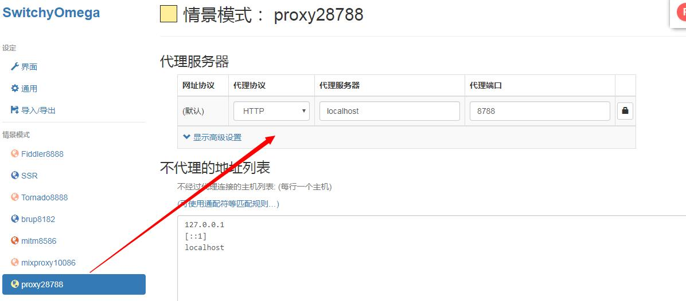
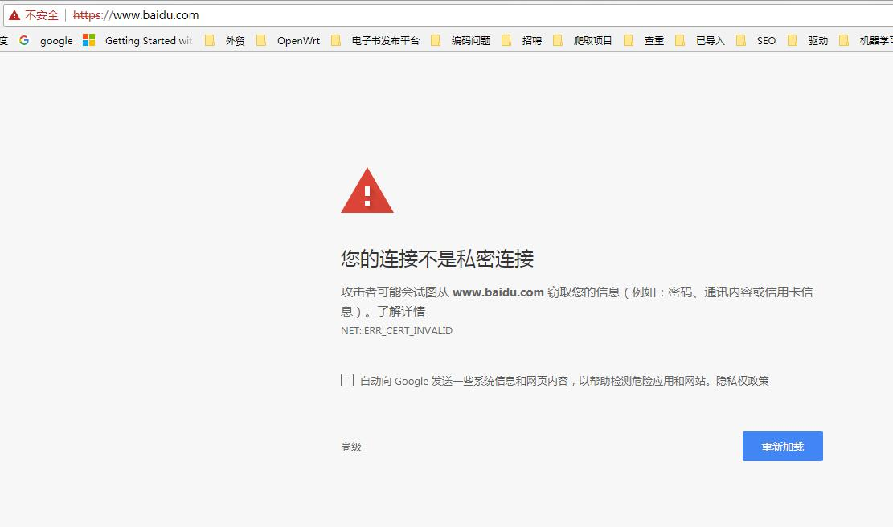
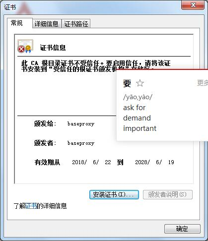
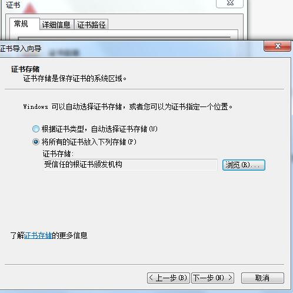

# BaseProxy
异步http/https代理,可拦截并修改报文Python,可以作为中间人工具.仅支持**py3.5+**.
<br>
个人公众号如下,欢迎大家交流。<br>

## 意义
BaseProxy项目的本意是为了使HTTP/HTTPS拦截更加纯粹,更加易操作,学习成本更低。
<br>
在Python领域,中间人工具非常强大和成功的是MitmProxy,但是有些地方不是很喜欢。
- Windows上安装比较费时费力
- 功能太多了,可惜我用不到这么多(似乎不是它的错，哈哈)
- 随着版本升级,采用插件化框架,需要定制功能,需要写个插件成为它的一部分(我只是想集成它而已).

因此BaseProxy就诞生了,不仅支持HTTPS透明传输,还支持HTTP/HTTPS拦截,简单易用,可以很好地集成到你们的项目中。
## 安装
安装非常简单,本项目已经发布到PyPI中...
```
pip3 install baseproxy
```
## 使用配置
### 启动baseproxy
在test文件夹下，有很多测试用例。以startserver.py为例。
```
from baseproxy.proxy import AsyncMitmProxy

baseproxy = AsyncMitmProxy(https=True)

baseproxy.serve_forever()
```
使用上述代码,就可以将HTTPServer运行起来了.对代码的解释如下:

- ```https=True```是对https进行解密;```https=False```是对于https实行透传
- baseproxy默认运行在8788端口,如果想改变端口的话,修改为```AsyncMitmProxy(server_addr=('',port),https=True)```.

运行结果如下:
```
[2018-06-22 18:46:32] INFO HTTPServer is running at address(  , 8788 )......
```

### 安装CA证书
1.将chrome浏览器代理服务器设置为127.0.0.1:8788,推荐使用SwitchyOmega插件.



2.设置好代理,并将baseproxy运行后,访问www.baidu.com.



3.这时候访问被拒绝,需要安装证书.在当前网页访问 baseproxy.ca,下载证书.


4.双击下载的证书,并安装到合法机构中.






5.接着访问百度就可以了.


**注意：只有```https=True```时,才需要安装CA证书。**


## 开发
经过上一步的使用配置,baseproxy已经可以正常运行了,但是这样是远远不够的.baseproxy还提供了接口,方便开发者对http请求和响应进行修改.
### 接口
baseproxy提供了两个接口,一个是修改请求,一个是修改响应.

#### 拦截请求
```
class ReqIntercept(InterceptPlug):

    def deal_request(self,request):
        pass


```
对于请求的拦截,需要继承ReqIntercept类,并重写其中的deal_request函数.在deal_request函数的最后,需要将修改后的request参数返回出去.
如果想抛弃这个请求,直接返回None.

#### request参数
deal_request函数中的request参数类型为Request类
<br>
**成员变量**

| Name        | 类型    |  含义  |
| --------   | -----:   | :----: |
| hostname        | str     |   域名    |
| port        | int      |   端口    |
| command        | str      |   请求类型    |
| path        | str      |   请求路径    |
| request_version        | str      |   HTTP协议版本    |

**成员函数**

```

    def set_headers(self,headers)
     - headers:类型为dict
     - 用于设置头部
```
```
    def get_header(self,key):
    - key:类型为str
    - 用于获取指定头部,返回str
```
```
    def get_headers(self):
    - 用于获取整个头部,返回为dict
```
```
    def set_header(self,key,value):
    - 头部 key,类型str
    - 头部 value,类型str
    - 用于设置头信息
```
```
    def get_body_data(self):
    - 获取请求体内容,返回类型为bytes
```

```
    def set_body_data(self,body):
    - 设置请求体内容,body类型为bytes

```

#### 拦截响应
```
class RspIntercept(InterceptPlug):

    def deal_response(self,response):
        pass

```
对于响应的拦截,需要继承RspIntercept类,并重写其中的deal_response函数.在deal_response函数的最后,需要将修改后的response参数返回出去.
如果想抛弃这个响应,直接返回None.

#### response参数
deal_response函数中的response参数类型为Response类
<br>
**成员变量**

| Name        | 类型    |  含义  |
| --------   | -----:   | :----: |
| hostname        | str     |   域名    |
| port        | int      |   端口    |
| status        | int      |   状态码   |
| reason        | str      |   状态描述    |
| response_version        | str      |   HTTP协议版本    |
| request        | Request      |   响应对应的请求实例    |


**成员函数**

```

    def set_headers(self,headers)
     - headers:类型为dict
     - 用于设置头部
```
```
    def get_header(self,key):
    - key:类型为str
    - 用于获取指定头部,返回str
```
```
    def get_headers(self):
    - 用于获取整个头部,返回为dict
```
```
    def set_header(self,key,value):
    - 头部 key,类型str
    - 头部 value,类型str
    - 用于设置头信息
```
```
    def get_body_data(self):
    - 获取响应体内容,返回类型为bytes
```

```
    def set_body_data(self,body):
    - 设置响应体内容,body类型为bytes

```
```
    def get_body_str(self,decoding=None):
    - decoding:编码,默认为None,内部采用chardet探测
    - 返回响应体,类型为str.如果无法解码,返回None

```
```
    def set_body_str(self,body_str,encoding=None):
    - encoding:编码,默认为None,内部采用chardet探测
    - 设置响应体,body_str类型为str
```

### 注册拦截插件
将拦截类完成后，需要注册到baseproxy中,需要调用AsyncMitmProxy的register函数.示例如下:
```
from baseproxy.proxy import ReqIntercept, RspIntercept, AsyncMitmProxy
__author__ = 'qiye'
__date__ = '2018/6/21 23:35'

class DebugInterceptor(ReqIntercept, RspIntercept):
    def deal_request(self, request):
        return request

    def deal_response(self, response):
        return response

if __name__=="__main__":

    baseproxy = AsyncMitmProxy(https=False)
    baseproxy.register(DebugInterceptor)
    baseproxy.serve_forever()

```
## 小例子
将淘宝中的所有产品图片换成**我公众号的二维码**.代码在test文件夹的replace_image.py中,内容如下:
```
from baseproxy.proxy import RspIntercept, AsyncMitmProxy


class ImageInterceptor( RspIntercept):

    def deal_response(self, response):
        if response.get_header("Content-Type") and 'image' in response.get_header("Content-Type"):
            with open("../img/qiye2.jpg",'rb') as f:
                response.set_body_data(f.read())
        return response


if __name__ == "__main__":
    baseproxy = AsyncMitmProxy(https=True)
    baseproxy.register(ImageInterceptor)
    baseproxy.serve_forever()
```
效果如下:


## 参考项目
[MitmProxy](https://github.com/mitmproxy/mitmproxy)
<br>
[proxy2](https://github.com/inaz2/proxy2)


#

